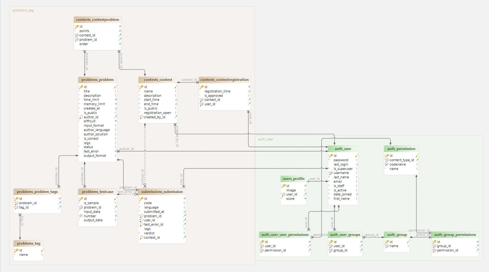

# Это учебный проект специализации Django
### Дисклеймер: все команды написаны для операционной системы linux, при их вызове проверьте, что на вашей OS они будут работать также, в ином случае поменяйте их в соответствие с синтаксисом терминала вашей OS  
## Необходимое ПО:
1. [Python](https://www.python.org/downloads/) версия 3.11, остальные версии могут работать нестабильно
2. [Git](https://git-scm.com/downloads) нужен для установки проекта из репозитория
3. [gettext](https://github.com/mlocati/gettext-iconv-windows/releases/tag/v0.23-v1.17) нужен для работы локализации (если у вас линукс, можете воспользоваться следующей командой)
```bash
apt install gettext
```
4. [Docker](https://docs.docker.com/engine/install/) нужен для поднятия брокера сообщений в лице redis
## Установка проекта:
Для установки проекта вы можете прописать следующую команду в терминал:
```bash
git clone https://github.com/Nitor112221/clash_of_code 
```
После нужно перейти в директорию проекта:
```bash
cd team-1
```
## Создание виртуального окружения для проекта:
* Создание виртуального окружения: 
```bash
python3 -m venv .venv
```
* Активация виртуального окружения:
```bash
source .venv/bin/activate
```
## Установка зависимостей
* Зависимости для продакшена: 
```bash
pip install -r requirements/prod.txt
```
* Зависимости для разработки:
```bash
pip install -r requirements/dev.txt
```
* Зависимости для тестирования: 
```bash
pip install -r requirements/test.txt
```
## Подготовка к запуску
* Скопируйте все параметры из файла template.env в .env с помощью команды:
```bash
cp -r template.env .env
```
* Установите нужные вам настройки в файле .env
* После этого перейдите в основную директорию проекта
```bash 
cd clash_of_code
```
### Подготовка базы данных
* Создание базы данных (для этого нужно применить все миграции):
```bash
python manage.py migrate
```
* Если у вас есть дамп базы данных, подходящей по структуре ER схемы, вы можете его загрузить с помощью следующей команды
```bash
python manage.py loaddata <путь до файла с вашей фикстурой>
```
### Подготовка админ-панели
* Создание супер пользователя для входа в админ-панель (запомните данные, которые вы ввели)
```bash
python manage.py createsuperuser 
```
* Теперь вы сможете зайти в админ панель по адресу `127.0.0.1:8000/admin` или по другому, который вы настроили для вашей системы
#### Внимание в проекте теги к задачам можно создавать только через admin панель, это сделано для того, чтобы теги были только официальные и имели смысл
### Подготовка локализации
* Скомпилировать файлы локализации:
```bash
django-admin compilemessages
```
### Подготовка тестирующей системы
* Перейдите в директорию с образом языка (это можно сделать с помощью команды ниже)
```bash
cd docker/images/python
```
* соберите контейнер для тестирующей системы для языка python:
```bash
docker build -t python3_11_image .
```
* Вернитесь назад в директорию проекта
```bash
cd ../../..
```
* Запустите redis в качестве брокера сообщений через docker 
```bash
docker run -d -p 6379:6379 redis
```
* Чтобы проверить, что redis успешно запустился можете выполнить команду:
```bash
docker container ls
```
* в списке запущенных образов должен быть redis

## Запуск
### Внимание, перед запуском основного сервера рекомендуется запустить worker (если вы запустите их не в том порядке, ничего критичного не произойдёт, все посылки будут добавлены в redis и начнут выполнятся после запуска worker'а)
* Запуск тестирующей системы (для linux):
```bash
celery -A clash_of_code worker -l info
```
* Запуск тестирующей системы (для windows):
```bash
celery -A clash_of_code worker -l info -P gevent
```
* Запустить приложение: 
```bash
python manage.py runserver
```

Готово, теперь вы можете перейти на сайт по адресу `127.0.0.1:8000` или `localhost:8000`
## Тестирование
#### В проекте есть тесты, к сожалению из-за особенности сервера под ci/cd там нельзя запустить docker в docker, по этой причине часть тестов была исключена из проверки в ci/cd, вы можете проверить эту группу тестов отдельно с помощью команды:
```bash
python manage.py test --tag test_system
```
Внимание, чтобы тесты прошли у вас на машине должен быть запущен докер 
# Информация про проекте
## Структура базы данных

